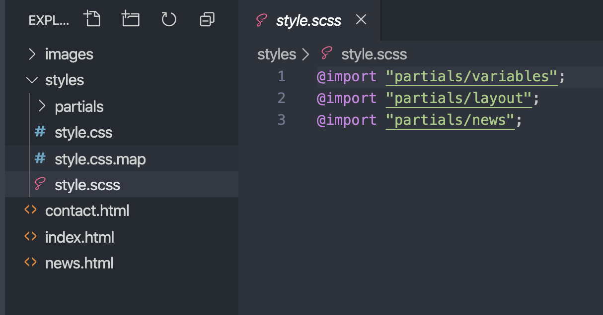

# CSS Frameworks Course Assignment Resit

## Brief

From the supplied designs and images, create a fully responsive, 3-page website using Bootstrap, BEM and one of Sass, LESS or Stylus.

## Level 1 Process

Use Bootstrap 4 (or 3 if you'd prefer) components for the elements in the design, and customise the components using a CSS pre-processor.

- The header and footer background colours and the carousel should span the full-width of the screen. The content should be in a container with a max-width.
- There are three images attached for the carousel on the home page. It should fade between images, not slide.
- Add a hover colour of your choice to the buttons.
- You can use any lorem ipsum text for the content.
- Make sure the active nav link is styled.
- Use BEM naming conventions for the custom classes you use to style the news items on the News page. You may use BEM elsewhere too.
- Make sure the site is fully responsive and there are no horizontal scrollbars on any width.

### Styles
The logo and headings use `Noto Serif`, the rest of the text is `Lato`. Both are Google fonts.

Font sizes in px: 

- Logo: 22
- Menu: 13
- Page heading: 24
- Page sub-heading: 20
- Body text and input placeholders: 16
- Buttons: 13
- Footer: 11

### Arranging your code

> The examples here use Sass.

Only `.html` files should be in the root of your project folder, other file types should live in their own folders.

Divide your Sass files into partials and import them in style.scss. You can decide how you want to split your partials, but they might include:
    - _variables.scss
    - _layout.scss
    - _typography.scss
    - _news.scss
    - _forms.scss
    - etc...

It is good practice to keep your colours and import your fonts in the `_variables` partial and import it first.

Below is an example. You will have more Sass partial files in your project.

---

If you use VSCode, you can use the [Live Sass Compiler](https://marketplace.visualstudio.com/items?itemName=ritwickdey.live-sass) to watch and compile your Sass files instead of the command line/terminal.

---

## Resources

The images are attached as a zip.

## Marking Criteria

- Proper implementation of Bootstrap components
- Well-organised pre-processor files
- Custom styles match the supplied designs
- Project is properly responsive

## Submission

Zip all your files and name it {your-name}-css-frameworks.zip

## Time

40 hours